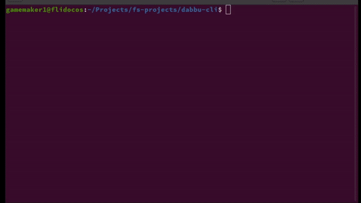

# Dabbu CLI

A CLI that leverages the Dabbu API and neatly retrieves your files and folders scattered online.

## Intro

Tired of having your files and folders randomly scattered about online with multiple providers like Google Drive and One Drive? Want to access all your files and folders using a single, unified interface? Dabbu’s APIs (Application Programming Interfaces) allow you to access your files and folders from any provider (Google Drive, Gmail, Microsoft OneDrive, etc) from a single, unified interface. Behind these APIs is a software layer that connects to these providers and returns your files and folders in one unified format. We'll let this GIF do the talking:

Dabbu CLI retrieving files from Google Drive [Note: this GIF is outdated]

What you just saw there was Dabbu CLI in action - a simple program in javascript that leverages the Dabbu API to bring your files and folders to your fingertips from all over the web.

**This repo contains the CLI application's source code. To view and install the server that handles API calls from clients like this one, go [here](https://github.com/gamemaker1/dabbu-server).**

## Getting started

The installation can be done manually on Linux, Alpine Linux, MacOS, Android (Requires Termux) and Windows (Currently only 64-bit architectures are supported).

Follow the instructions [here](https://dabbu-knowledge-platform.github.io/impls/cli) to install it on your computer.

## Providers supported

- **Hard drive**
- **Google drive**
- **Gmail**
- **One Drive**

_And more to come...!_

### Creating a new provider

If you want to create a client for a provider supported by the server but not the CLI, please file an issue using the `New client` template [here](https://github.com/dabbu-knowledge-platform/cli/issues/new/choose). This is only to let us know that you want to work on the provider and how you plan to go about it.

Please read [CONTRIBUTING.md](./CONTRIBUTING.md) for a detailed guide to setting up your environment and making changes to the code.

Also, if you need any help on the code, please do ask on [this](https://github.com/dabbu-knowledge-platform/cli/discussions/categories/want-to-contribute) Github discussion. We will only be glad to help :)

## Docs

The documentation for the CLI can be found on the [website](https://dabbu-knowledge-platform.github.io/impls/cli). The source can be found [here](https://github.com/dabbu-knowledge-platform/dabbu-knowledge-platform.github.io/blob/main/impls/cli.md).

## Issues and pull requests

You can contribute to Dabbu by reporting bugs, fixing bugs, adding features, and spreading the word! If you want to report a bug, create an issue by clicking [here](https://github.com/dabbu-knowledge-platform/cli/issues/new/choose). While creating an issue, try to follow the Bug report or Feature request template.

Please read [CONTRIBUTING.md](./CONTRIBUTING.md) for a detailed guide to setting up your environment and making changes to the code.

## Legal stuff

### License - GNU GPL v3

Dabbu CLI - A CLI that leverages the Dabbu API and neatly retrieves your files and folders scattered online.

Copyright (C) 2021 gamemaker1

This program is free software: you can redistribute it and/or modify
it under the terms of the GNU General Public License as published by
the Free Software Foundation, either version 3 of the License, or
(at your option) any later version.

This program is distributed in the hope that it will be useful,
but WITHOUT ANY WARRANTY; without even the implied warranty of
MERCHANTABILITY or FITNESS FOR A PARTICULAR PURPOSE. See the
GNU General Public License for more details.

You should have received a copy of the GNU General Public License
along with this program. If not, see <https://www.gnu.org/licenses/>.
