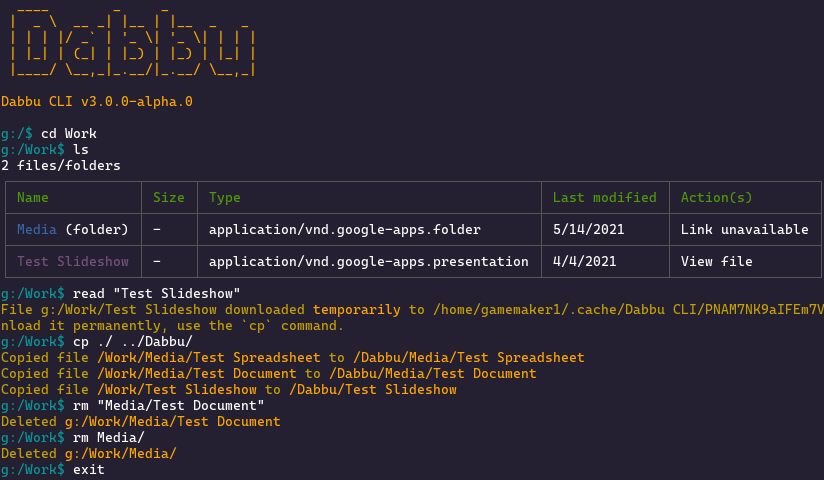

## Dabbu CLI

[](https://github.com/dabbu-knowledge-platform/cli/actions/workflows/ci.yaml) [](https://img.shields.io/badge/platforms-windows%20linux%20macos%20alpine-blue)

With the Dabbu Knowledge Platform, we aim to rethink the way we organize and traverse large amounts of knowledge, no matter where it is stored.

Dabbu allows you to access any of your personal information (Gmail, Google Drive, OneDrive, your hard drive, ...) as simple files and folders from Dabbu CLI.

<div align="center">
	<br>
	
	<br>
	<br>
</div>

It not only allows you to seamlessly search/traverse your information across these sources (as simple as `cd`, `list`), but also move information around between drives (`copy`) - yes even your Gmail messages in a thread get copied to your hard drive as `.md` files in a zip if you do a `harddrive:/$ cp gmail:/INBOX/ ./"My Emails"`.

You can also go into the special knowledge drive where you can pivot information by topics/people/places e.g. `knowledge:/$ cd austin` (will return you all your information from Gmail, Google Drive, OneDrive that has a reference to the place Austin). You can further narrow your search by doing `knowledge:/austin$ cd ravi@example.com` (yes it even extracts people and allows you to pivot information by them). This would show you all emails and files that are related to Austin and from/to ravi@example.com.

All of this has been implemented by abstracting access to providers (you can add more providers as modules) and exposing a unified API for information (no matter where and what form it takes).

The only way to use Dabbu (at the moment) is through a command-line interface (CLI). A desktop interface is in the works.

## Installation

Excited to use Dabbu? Here's how to install it on your machine:

### Windows

Download the latest `windows-generic` release from the [releases page](https://github.com/dabbu-knowledge-platform/cli/releases/latest). Once downloaded, unzip it and run the `.exe` file by double clicking on it. Run the `.exe` file every time you want to run the CLI.

### MacOS

Download the latest `macos-pkg` release from the [releases page](https://github.com/dabbu-knowledge-platform/cli/releases/latest). Once downloaded, simply double click on the .pkg file to install the CLI. Then run the CLI from the terminal by typing `dabbu-cli` and hitting enter.

If this method does not work, download the latest `macos-generic` release from the [releases page](https://github.com/dabbu-knowledge-platform/cli/releases/latest). Once downloaded, unzip and extract all the files into a directory (for example, ~/Downloads/dabbu-cli-macos-generic-amd64/). Then run the following in terminal:

```bash
cp ~/Downloads/dabbu-cli-macos-generic-amd64/dabbu-cli /usr/bin/
chmod 777 /usr/bin/dabbu-cli
```

Then run the CLI by typing `dabbu-cli` and hitting enter.

### Linux - DEB file (Debian/Ubuntu/Linux Mint/etc)

Download the latest `linux-deb` release from the [releases page](https://github.com/dabbu-knowledge-platform/cli/releases/latest). Once downloaded, simply double click on the `.deb` file to install the CLI. Then run the CLI from the terminal by typing `dabbu-cli` and hitting enter.

If double clicking the `.deb` file does not open it in software centre, run the following in terminal (this command assumes you downloaded the `.deb` file to `~/Downloads/dabbu-cli-linux-deb-amd64.deb`):

```bash
dpkg -i ~/Downloads/dabbu-cli-linux-deb-amd64.deb
```

Then run the CLI from the terminal by typing `dabbu-cli` and hitting enter.

### Linux - RPM file (RedHat/CentOS/Fedora/etc)

Download the latest `linux-rpm` release from the [releases page](https://github.com/dabbu-knowledge-platform/cli/releases/latest). Once downloaded, simply double click on the `.rpm` file to install the CLI. Then run the CLI from the terminal by typing `dabbu-cli` and hitting enter.

If double clicking the `.rpm` file does not open it in software centre, run the following in terminal (this command assumes you downloaded the `.rpm` file to `~/Downloads/dabbu-cli-linux-rpm-amd64.rpm`):

```bash
rpm -ivh ~/Downloads/dabbu-cli-linux-rpm-amd64.rpm
```

Then run the CLI from the terminal by typing `dabbu-cli` and hitting enter.

### Linux - Arch Linux/Manjaro

Download the latest `linux-arch` release from the [releases page](https://github.com/dabbu-knowledge-platform/cli/releases/latest). Once downloaded, run the following in terminal (this command assumes you downloaded the `.tar.gz` file to `~/Downloads/dabbu-cli-linux-arch-amd64.tar.gz`):

```bash
pacman -U ~/Downloads/dabbu-cli-linux-arch-amd64.tar.gz
```

Then run the CLI from the terminal by typing `dabbu-cli` and hitting enter.

### Linux - Alpine

Download the latest `linux-alpine` release from the [releases page](https://github.com/dabbu-knowledge-platform/cli/releases/latest). Once downloaded, run the following in terminal (this command assumes you downloaded the `.apk` file to `~/Downloads/dabbu-cli-linux-alpine-amd64.apk`):

```bash
apk add --allow-untrusted ~/Downloads/dabbu-cli-linux-alpine-amd64.apk
```

> Note: The --allow-untrusted flag is required as we do not sign the file as of now. If you do not feel comfortable using this flag, you may build the CLI from source.

Then run the CLI by typing `dabbu-cli` and hitting enter.

### Linux - Generic

If you want to install the executable yourself, download the latest `linux-generic` release from the [releases page](https://github.com/dabbu-knowledge-platform/cli/releases/latest). Once downloaded, unzip and extract all the files into a directory (for example, ~/Downloads/dabbu-cli-linux-generic-amd64/). Then run the following in terminal:

```bash
cp ~/Downloads/dabbu-cli-linux-generic-amd64/dabbu-cli /usr/bin/
chmod 777 /usr/bin/dabbu-cli
# The following commands are optional, but recommended
cp ~/Downloads/dabbu-cli-linux-generic-amd64/dabbu-cli.1 /usr/share/man/man1/
cp ~/Downloads/dabbu-cli-linux-generic-amd64/logo.png /usr/share/icons/dabbu-cli.png
cp ~/Downloads/dabbu-cli-linux-generic-amd64/dabbu-cli.desktop /usr/share/applications/
```

Then run the CLI by typing `dabbu-cli` and hitting enter.

If you run into any problems while installing or using Dabbu CLI, feel free to ask [here](https://github.com/dabbu-knowledge-platform/cli/discussions/categories/q-a). We'll only be glad to help :)

### Building from source

To build the CLI from source, follow the instructions given below:

#### Install `git`, `nodejs` and `yarn`.

`git` **must** be installed to make pull requests and push changed code.

- To check if git is already installed, type `git --version` in terminal/command prompt. You should see a version number displayed after running this command.
- [Here](https://github.com/git-guides/install-git) are the official instructions to install git for all platforms in case you haven't installed it already.

`nodejs` and `yarn` **must** be installed to run the CLI locally.

- To check if NodeJS and Yarn already installed, type `node --version && yarn --version` in terminal/command prompt. You should see two version numbers displayed after running this command. For developing Dabbu CLI, we use the latest version of Typescript, which compiles to CommonJS code.
- [Here](https://nodejs.org/en/download/package-manager/) are the official instructions to install NodeJS and Yarn for all platforms in case you haven't installed it already.

#### Clone the source code

Run the following in a terminal to clone the repository locally:

```sh
$ git clone https://github.com/dabbu-knowledge-platform/cli
$ cd cli
```

#### Build the CLI

All you need to do to build is run `yarn package`. If the command runs successfully, you will be able to see the generated packages in the `dist/packages/` folder and binaries in the `dist/binaries/` folder. The packages are the same as the ones distributed as part of the [latest release](https://github.com/dabbu-knowledge-platform/cli/releases/latest/). The binaries generated (`cli-alpine`, `cli-linux`, `cli-macos`, and `cli-win.exe`) can be run on alpine, linux, macos and windows respectively without installation of external dependencies.

On Windows, you can double click on the `.exe` file from file manager to run the CLI. On Linux/MacOS, simply type the path to the files (`./dist/cli-alpine` OR `./dist/cli-linux` OR `./dist/cli-macos`) in terminal and hit enter to run the CLI.

## Getting started

### Setup

Once Dabbu is started for the first time, it will ask you for a server URL. Please enter `https://dabbu-server.herokuapp.com`.

Then, Dabbu will ask you to setup your first 'drive'. A drive is just like a usb drive attached to your computer - `c:`, `d:`, `e:`, etc - but instead of showing files from the USB drive, it shows you files and folders from a certain provider (Gmail, Google Drive, OneDrive, ...). Follow the instructions Dabbu shows you to setup the drive.

You can use several commands to tell Dabbu what you want to do. Read on to know more about how to use them.

### Using commands

#### **The prompt**

Once a drive is created, you will see something called a 'prompt' on the screen. It looks like this:

```
<drive name>:/$
```

> For those who are already familiar with the bash shell: Dabbu is sort of a shell, and its commands are very similar to bash commands. Take a look at the [summary of CLI commands](#a-brief-summary-of-cli-commands) for a quick summary of all the commands you can run.

The prompt shows you what drive which folder/directory you are currently in. You can also type `pwd` (short form for **P**rint **W**orking **D**irectory) and hit `enter` to know that information.

#### **Moving around**

Dabbu has a notion of the _current working directory_, which refers to what folder/directory you are currently in. A special symbol, `.` (the full stop), is used to refer to the current folder/directory you are in. Another special symbol, `..` (two full stops), is used to refer to the _parent folder/directory_ of the current working directory.

The current path is always shown in the prompt after the drive name:

```
<drive name>:<path to folder you are in>$
```

The topmost folder is always called `/` (forward slash). To change folders, type in `cd <folder to move to>/` (`cd` is short form for **C**hange **D**irectory) and hit `enter`. For example, the following command will move you into the directory `Work`:

```
cd Work/
```

**Note**: The forward slash at the end is required - it tells Dabbu that we are talking about a folder.

Now that you have moved into the folder `Work`, the prompt will change to update your current working directory:

```
<drive name>:/Work$
```

To move back into the root folder (`/`), type in `cd ..` (remember that `.` refers to the current working directory, while `..` refers to the parent directory) and hit `enter`. This should move you to the root folder and also update your prompt to show `/` as the current path.

To switch to another drive, type in the following and hit `enter`:

```
cd <drive name>:
```

Notice the colon at the end - it tells Dabbu that you are talking about a drive.

To create a new drive, simply type in `new-drive` and hit enter.

#### **Listing files and folders**

To list files and folders within the your current working directory, type in `list`. For example, if I am in the `Work` directory, typing in `list` will show you a list of the files and folders within the `Work` directory.

Optionally, you can specify which directory's files and folders to list using `list <directory whose files and folders to list>`. For example, if I am in the root (`/`) directory, I can list files from the `Work` directory by typing `list Work/` and hitting `enter`.

The `list` command prints the number of files in that folder (if there are less than 50 files) and a table of the files and folders. The table has 4 columns: `Name`, `Size`, `Type`,`Last Modified Time` and `Actions`. The file/folder name is coloured blue if it is a folder (it also has the words folder written in brackets next to the name) and magenta if it is a file. The size and last modified time are formatted into human readable formats. The type column shows the type of the file. The actions column contains a link that opens the file in the provider's preferred editor. This means that if you click on a link for a from Google Drive, it will open the Google Drive File Viewer to display the file. Use the `read` command to download and view the file on your computer.

#### **Downloading and viewing files**

To download a file to your computer and open it up, type in `read <path to file>` and hit `enter`. This will download the file temporarily on your computer and open it using the default app to open that file on your computer. The file will be deleted once Dabbu is closed. For example, to download the file `Dabbu Design Document` in the `Work` folder, type in the following and hit `enter`:

```
read "Work/Dabbu Design Document"
```

Notice that the path to the file is surrounded by quotes (`"`). This is only required if the file/folder name contains spaces.

If you want to save the file to your hard drive or to another drive, use the `copy` (copy) command as mentioned below.

#### **Copying/moving files**

To copy a file from one drive to another drive, use the `copy` (short form for **c**o**p**y) command as follows:

```
copy <path to file that you want to copy> <path to destination folder>
```

For example, if I want to copy a file (say, `School Project.docx`) from my `Personal` folder on `g:` (where I have set up a Google Drive account) to the `Work` folder on `c:` (where I have set up my hard drive), I would type the following and hit `enter`:

```
copy "g:/Personal/School Project.docx" c:/Work/
```

Notice two things:

- One, the path to the `School Project.docx` file is surrounded by quotes. This is because the file name contains spaces.
- Two, the path to the `Work` folder ends with a `/`. This is to tell Dabbu that `Work` is a folder.

If I want to copy the file `School Project.docx` from my `Personal` folder on `g:` (where I have set up a Google Drive account) to the `Work` folder on `c:` (where I have set up my hard drive) and rename it to `MyProject.docx`, I would type the following and hit `enter`:

```
copy "g:/Personal/School Project.docx" c:/Work/MyProject.docx
```

Notice two things:

- One, the path to the `School Project.docx` file is surrounded by squotes. This is because the file name contains spaces.
- Two, the path to the destination does not end with a `/`. This i because we are copying the file to another file, and not another folder.

To rename a file without copying it, or to move a file instead of copying it, just use `mv` instead of `copy`.

#### **Deleting files**

To delete a file on a certain drive, use the `del` ((short form for **r**e**m**ove)) command. For example, to delete the file `Dabbu Design Document` in the `Work` folder, type in the following and hit `enter`:

```
del "Work/Dabbu Design Document"
```

Notice that the path to the file is surrounded by quotes (`"`). This is only required if the file/folder name contains spaces.

To delete the entire work folder:

```
del Work/
```

Notice that the path to the `Work` folder ends with a `/`. This is to tell Dabbu that `Work` is a folder.

Be careful while using the `del` command as it usually permanently deletes files and folders.

### A Brief Summary of CLI Commands

**Note:**

- Anything in <> must be mentioned, while if it is in [], it is optional.
- All file/folder paths may include drive names.
- While specifying a folder, please add a / at the end of the folder name.
- Escape spaces in the file name by surrounding it in quotes.

**Commands:**

- `pwd` - Know your current drive and folder
- `cd <drive name>:` - Switch drives (Notice the colon at the end of the drive name)
- `cd <relative path to folder>` - Move into a folder
- `list [relative path to folder]` - List files in a folder (default is current folder)
- `read <relative path to file>` - Download and open a file
- `copy <relative path to file> <relative path to place to copy to>` - Copy a file from one place to another
- `del <relative path to file>` - Delete a file
- `new-drive` - Create a new drive
- `clear` - Clear the screen
- `CTRL+C OR exit` - Exit

Typing any of the above and then hitting enter will allow you to execute that command and get a result.

## Providers supported

- **Hard drive**
- [**Google drive**](https://github.com/dabbu-knowledge-platform/files-api-server/blob/develop/docs/providers/googledrive.md)
- [**Gmail**](https://github.com/dabbu-knowledge-platform/files-api-server/blob/develop/docs/providers/gmail.md)
- [**One Drive**](https://github.com/dabbu-knowledge-platform/files-api-server/blob/develop/docs/providers/onedrive.md)

_And more to come...!_

### Creating a new provider

If you want to create a client for a provider supported by the server but not the CLI, please file an issue using the `New client` template [here](https://github.com/dabbu-knowledge-platform/cli/issues/new/choose). This is only to let us know that you want to work on the provider and how you plan to go about it.

Please read [contributing.md](./contributing.md) for a detailed guide to setting up your environment and making changes to the code.

Also, if you need any help on the code, please do ask on [this](https://github.com/dabbu-knowledge-platform/cli/discussions/readegories/want-to-contribute) Github discussion. We will only be glad to help :)

## Issues and pull requests

You can contribute to Dabbu by reporting bugs, fixing bugs, adding features, and spreading the word! If you want to report a bug, create an issue by clicking [here](https://github.com/dabbu-knowledge-platform/cli/issues/new/choose). While creating an issue, try to follow the Bug report or Feature request template.

Please read [contributing.md](./contributing.md) for a detailed guide to setting up your environment and making changes to the code.

## Legal stuff

### License - GNU GPL v3

Dabbu CLI - a CLI that allows you to access any of your personal information (Gmail, Google Drive, OneDrive, your hard drive, ...) as simple files and folders.

Copyright (C) 2021 Dabbu Knowledge Platform \<dabbuknowledgeplatform@gmail.com\>

This program is free software: you can redistribute it and/or modify
it under the terms of the GNU General Public License as published by
the Free Software Foundation, either version 3 of the License, or
(at your option) any later version.

This program is distributed in the hope that it will be useful,
but WITHOUT ANY WARRANTY; without even the implied warranty of
MERCHANTABILITY or FITNESS FOR A PARTICULAR PURPOSE. See the
GNU General Public License for more details.

You should have received a copy of the GNU General Public License
along with this program. If not, see <https://www.gnu.org/licenses/>.
